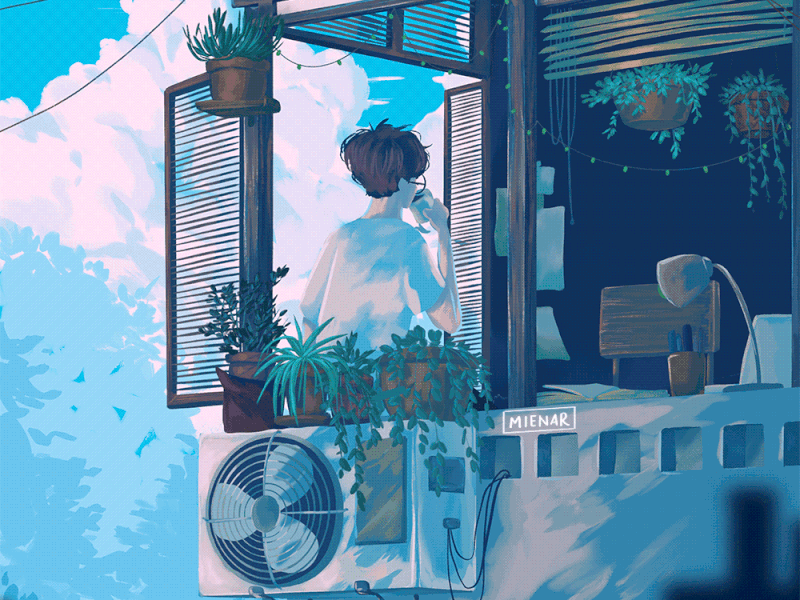

  

  
  
  

  

  
  
  

<h1 align="center"> RONAK </h1> 

 Introducing , A Simple Developer 

  

 &nbsp;
  

 

 Trying to Develop whatsapp bot
  <a href="https://github.com/adiwajshing/Baileys">Multi-Device Baileys.</a>

  </img>

    

align="center">Need help? please create an issue

***

<h1 align="center"> RONAK </h1> 

 Introducing , A Simple Developer 

  

 &nbsp;
  

 

 Trying to Develop whatsapp bot
  <a href="https://github.com/adiwajshing/Baileys">Multi-Device Baileys.</a>

  </img>

Need help? please create an issue

***
